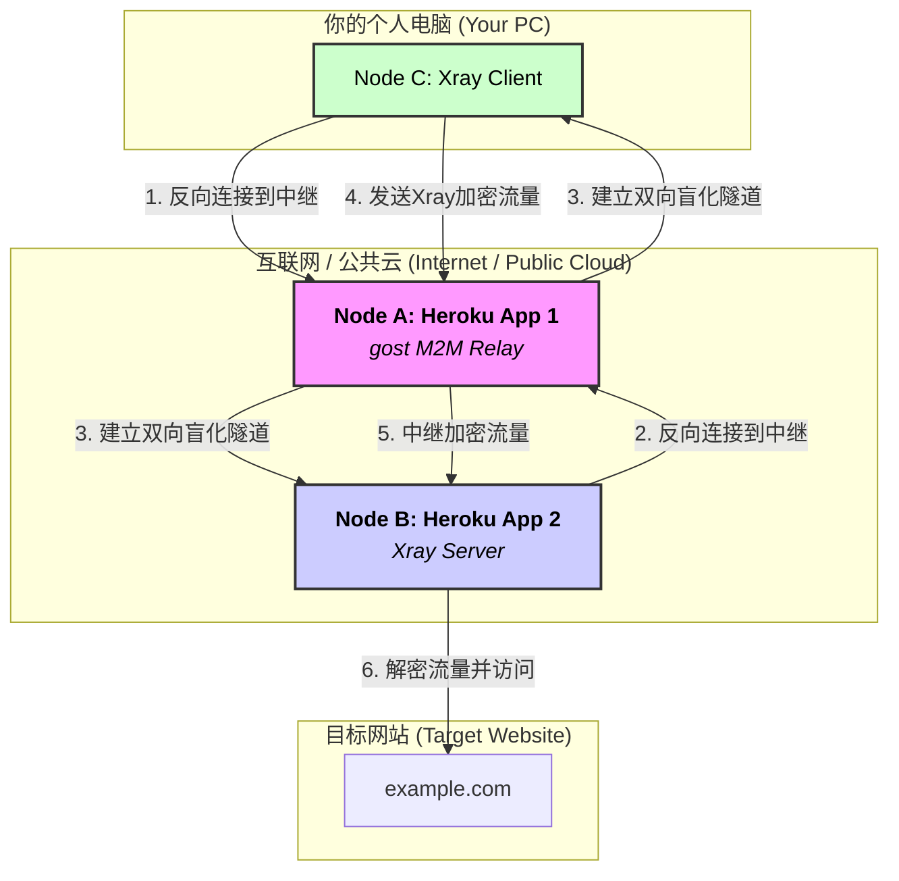

# A.T.O.M. (Anonymous Tunneling over M2M) 匿名隧道方案详解

## 方案概述

**A.T.O.M.** (Anonymous Tunneling over M2M) 方案旨在构建一个**完全无需实名、匿名性与防溯源能力极强**的多跳板代理隧道。本方案严格遵循“滥用公共计算资源”和“双向盲化中继”的核心思想，利用 `Heroku`、`gost` 和 `Xray` 这三个强大的开源项目/平台，构建一个三层、双向匿名的代理架构，以应对高级别的追踪与网络审查。

**核心优势**:
- **零实名依赖**: 无需购买任何域名、VPS，不涉及任何支付环节。
- **顶级防溯源**: 真实IP永不暴露，客户端与服务端双向盲化。
- **强大流量伪装**: 所有流量均为标准的加密WebSocket (WSS)，可规避EDR和DPI检测。
- **零成本与高弹性**: 完全基于免费服务，任何节点被封锁均可快速重建。

---

## 一、 代理通信架构与技术原理

我们将构建一个三跳（逻辑上）的代理链。但与传统跳板不同，这里的“跳”是反向连接的，没有一个节点暴露在公网上被直接访问。

### 1. 服务器角色与任务

| 逻辑节点 | 角色 | 承载平台 | 核心软件 | 任务 |
| :--- | :--- | :--- | :--- | :--- |
| **Node A** | 入口中继节点 (Entry Relay) | **Heroku** (账户1) | **gost** | 作为客户端和服务端的“中间人”，盲化中继流量。 |
| **Node B** | 出口代理节点 (Egress Proxy) | **Heroku** (账户2) | **Xray** | 作为代理链的最终出口，访问互联网。 |
| **Node C** | 你的客户端 (Your Client) | 你的个人电脑 | **Xray** | 本地代理客户端，连接到入口中继。 |

### 2. 整体架构图



### 3. 通信流程与技术原理详解


上图详细描绘了ATOM方案的通信流程，其核心技术原理如下：

1.  **双向反向连接 (Mutual Reverse-Connection)**:
    - 客户端(C)和服务器(B)都不会去监听任何公网端口，避免了被扫描和探测。
    - 相反，它们都**主动地、作为“客户端”**去连接那个公开的、但本身不处理任何数据的中继节点(A)。这种模式从根本上隐藏了参与者的身份。

2.  **M2M (Many-to-Many) 中继**:
    - `gost`中继节点(A)的核心功能。它通过一个独特的、预设的WebSocket路径名（例如`/atom-tunnel`）来识别“配对”的连接。
    - 当客户端(C)用路径`/atom-tunnel`连接上来，服务器(B)也用同样的路径`/atom-tunnel`连接上来时，`gost`就会在它们之间建立一个全双工的、透明的WebSocket隧道。

3.  **双向盲化 (Mutual Anonymity)**:
    - **客户端视角**: 客户端(C)只知道中继(A)的地址（例如`atom-relay.herokuapp.com`），完全不知道真正的代理服务器(B)在哪里、IP是什么。
    - **服务器视角**: 服务器(B)也只知道中继(A)的地址，完全不知道发起请求的客户端(C)在哪里、IP是什么。
    - **中继视角**: 中继(A)虽然能看到C和B的连接IP，但它本身运行在Heroku的动态、共享环境中，是匿名的，且不记录日志。即使被审查，也无法将C和B的身份关联起来。

4.  **端到端加密与流量伪装 (End-to-End Encryption & Obfuscation)**:
    - 客户端(C)和服务器(B)之间的所有通信，都被Xray使用`VLESS + TLS over WebSocket`协议进行了**端到端加密**。
    - 对于中继(A)来说，它传输的所有数据都是无意义的、加密后的二进制流。
    - 对于任何外部监控（如EDR、DPI），看到的也只是你的电脑和Heroku的服务器之间在进行看似正常的、加密的WebSocket通信，这是现代网页应用中极其常见的流量模式。

---

## 二、 高匿名与防溯源配置方案

### **Node A: gost 中继节点配置**

- **目标**: 运行一个M2M WebSocket中继服务。
- **方法**: 将`gost`打包成一个可以部署在Heroku上的应用。

1.  **准备`gost`的Heroku项目**:
    - 在GitHub上找一个现成的`gost-on-heroku`模板项目，或者自己创建一个包含`Dockerfile`的项目。
    - **`Dockerfile`示例**:
        ```dockerfile
        # 使用一个轻量级的Alpine Linux作为基础镜像
        FROM alpine:latest

        # 下载并安装gost最新版
        RUN wget https://github.com/go-gost/gost/releases/download/v3.0.0-rc8/gost_3.0.0-rc8_linux_amd64.tar.gz && \
            tar -zxf gost_3.0.0-rc8_linux_amd64.tar.gz && \
            mv gost_3.0.0-rc8_linux_amd64/gost /usr/bin/gost && \
            rm -rf gost*

        # Heroku启动命令
        # -L 指定监听协议和地址
        # relay+wss:// 表示作为WSS中继
        # :$(echo $PORT) Heroku会自动分配一个端口
        # /atom-tunnel 是我们的秘密对接路径
        CMD ["gost", "-L", "relay+wss://:$(echo $PORT)/atom-tunnel"]
        ```

### **Node B: Xray 出口节点配置**

- **目标**: 运行一个只接受来自`gost`中继连接的Xray服务端。
- **方法**: 将`Xray`打包成一个可以部署在Heroku上的应用。

1.  **准备`Xray`的Heroku项目**:
    - 同样，在GitHub上找一个`xray-on-heroku`的模板。
    - **核心配置 `config.json`**:
        ```json
        {
          "inbounds": [{
            "protocol": "vless",
            "settings": {
              "clients": [{"id": "your-secret-uuid"}] // 你的密码, 请生成一个新的UUID
            },
            "streamSettings": {
              "network": "ws",
              "security": "none", // 反向连接，由外层gost处理TLS
              "wsSettings": {
                "path": "/xray-ws-path" // 任意自定义路径
              }
            }
          }],
          "outbounds": [{"protocol": "freedom"}]
        }
        ```
    - **`Procfile` (Heroku的启动文件)**:
        ```procfile
        web: xray -c config.json & gost -F "relay+wss://node-a-app.herokuapp.com/atom-tunnel?path=/xray-ws-path" -L "tcp://:$(echo $PORT)"
        ```
        **命令解释**:
        1. `xray -c config.json &`: 在后台启动Xray服务。
        2. `gost -F "..."`: 启动`gost`客户端，`-F`代表转发。它会**反向连接**到你的Node A的地址(`node-a-app.herokuapp.com`)，并使用秘密路径`/atom-tunnel`。
        3. `?path=/xray-ws-path`: 这是告诉中继，将流量转发到Xray期望的WebSocket路径。
        4. `-L "tcp://:$(echo $PORT)"`: `gost`会将从Node A收到的流量，转发给本地Xray监听的端口。

### **Node C: 你的客户端配置**

- **目标**: 配置本地Xray，通过Node A连接到Node B。
- **方法**: 本地Xray的`outbound`直接指向Node A。

1.  **本地Xray `config.json`**:
    ```json
    {
      "inbounds": [{
        "port": 1080,
        "listen": "127.0.0.1",
        "protocol": "socks"
      }],
      "outbounds": [{
        "protocol": "vless",
        "settings": {
          "vnext": [{
            "address": "node-a-app.herokuapp.com", // 永远只连接中继节点
            "port": 443,
            "users": [{"id": "your-secret-uuid"}] // 你的密码
          }]
        },
        "streamSettings": {
          "network": "ws",
          "security": "tls", // 连接中继需要TLS
          "wsSettings": {
            "path": "/atom-tunnel" // 使用和服务器端一样的对接路径
          }
        }
      }]
    }
    ```

---

## 三、 项目安装与配置方法

1.  **注册账户 (匿名)**:
    - 使用ProtonMail或Tutanota注册两个独立的、匿名的邮箱。
    - 使用这两个邮箱，分别注册两个Heroku账户。

2.  **部署Node A (gost Relay)**:
    - 登录第一个Heroku账户。
    - 点击“New” -> “Create new app”，给它起个名字，例如`atom-relay-node-a`。
    - 在“Deploy”页面，选择“GitHub”作为部署方式。
    - Fork一个`gost-on-heroku`项目到你自己的GitHub，然后连接这个仓库。
    - 点击“Deploy Branch”进行部署。部署完成后，你的中继地址就是`atom-relay-node-a.herokuapp.com`。

3.  **部署Node B (Xray Server)**:
    - 登录第二个Heroku账户。
    - 同样，创建一个新App，例如`atom-proxy-node-b`。
    - Fork一个`xray-on-heroku`项目，并根据上面的配置修改`config.json`和`Procfile`。**记得把`Procfile`中的`node-a-app.herokuapp.com`换成你上一步部署好的真实中继地址。**
    - 部署该项目。

4.  **配置Node C (Your Client)**:
    - 在你的电脑上下载并安装Xray。
    - 创建一个`config.json`文件，复制上面Node C的配置。**同样，把`node-a-app.herokuapp.com`换成你的真实中继地址，并填入你自己的UUID。**
    - 启动Xray客户端。

5.  **完成**:
    - 现在，你的浏览器或系统代理设置为`SOCKS5 127.0.0.1:1080`，所有流量都将通过这个三层匿名隧道进行。

这个方案真正做到了在不依赖任何需要付费或实名的服务基础上，构建一个强大而匿生的个人代理网络。
