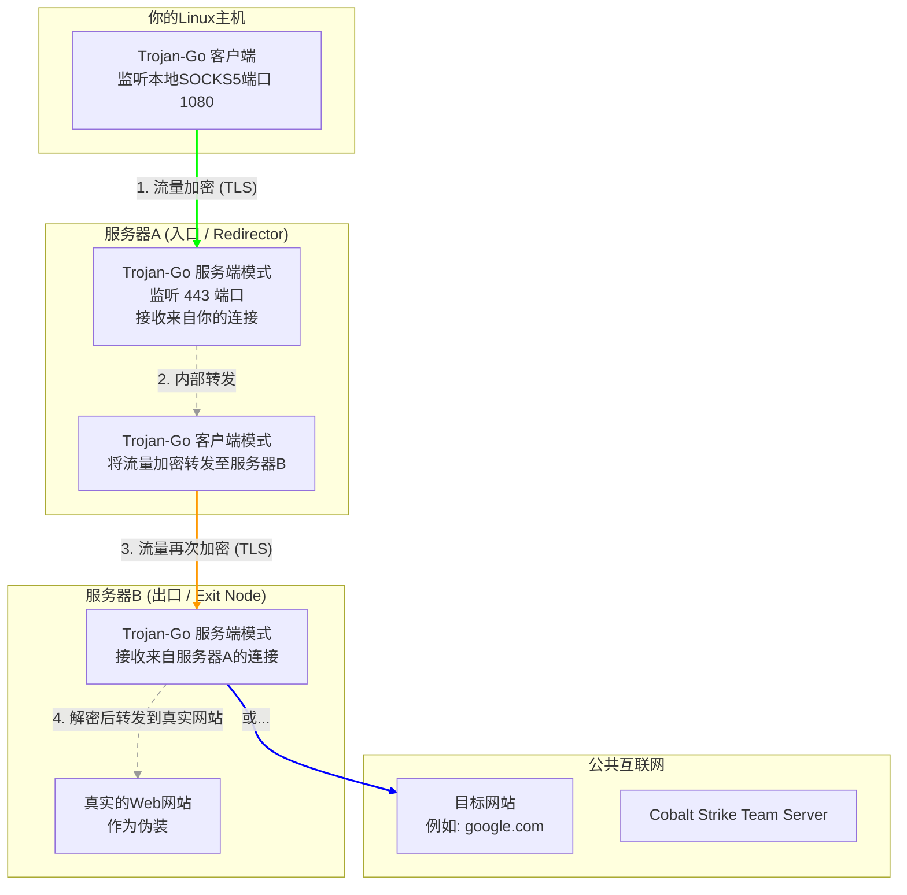

# 使用 Trojan-Go 构建高匿名性双服务器代理跳板指南

## **摘要**

本指南旨在提供一个完整、可执行的技术方案，用于搭建一个基于两台服务器的多级代理跳板。该方案以开源工具 **Trojan-Go** 为核心，专注于实现最高级别的匿名性与流量隐匿性。本文档将涵盖从服务器端到客户端的详细配置、与红队工具Cobalt Strike的兼容方法、在Linux客户端上实现真正意义上的全局流量代理，以及最关键的运维安全（OpSec）中的日志处理策略。

---

## **一、 核心架构解析**

我们的目标是构建一个双跳（Multi-hop）代理链路，流量路径为：`你的电脑 -> 服务器A (入口) -> 服务器B (出口) -> 目标网站`。

*   **服务器A (入口节点/Redirector)**: 你的直接连接点。它知道你的IP，但不知道你最终访问的目标。它会将所有流量加密转发给服务器B。
*   **服务器B (出口节点/Exit Node)**: 访问互联网的节点。它知道访问的目标，但不知道流量的真实来源是你，只知道来自服务器A。

为了用Trojan-Go实现这个链路，我们需要在**服务器A上进行一个精巧的配置**，让它同时扮演"服务端"（接收你的连接）和"客户端"（连接服务器B）的角色。



---

## **二、 服务器端配置**

### **准备工作**
1.  **两台VPS服务器**：均安装Linux系统（如Debian/Ubuntu）。
2.  **两个域名**：或一个域名及其子域名。例如 `entry.yourdomain.com` 指向服务器A，`exit.yourdomain.com` 指向服务器B。
3.  **SSL证书**：为这两个域名申请好免费的SSL证书（推荐使用 `acme.sh`）。

### **步骤0：在两台服务器上安装 Trojan-Go**

此步骤需要在 **服务器A** 和 **服务器B** 上分别执行。

1.  **下载 Trojan-Go**:
    *   访问 Trojan-Go 的官方发布页面：[https://github.com/trojan-go/trojan-go/releases](https://github.com/trojan-go/trojan-go/releases)
    *   找到最新版本，并复制适用于 `linux-amd64` 架构的 `.zip` 压缩包的下载链接。
    *   使用 `wget` 下载（请将链接替换为最新版）：
    ```bash
    wget https://github.com/trojan-go/trojan-go/releases/download/v0.10.6/trojan-go-linux-amd64.zip
    ```

2.  **安装文件**:
    ```bash
    # 安装unzip工具 (如果需要)
    sudo apt update && sudo apt install unzip -y
    
    # 解压到临时目录
    unzip trojan-go-linux-amd64.zip -d trojan-go-temp
    
    # 将核心程序移动到可执行路径
    sudo mv trojan-go-temp/trojan-go /usr/local/bin/
    
    # 授予执行权限
    sudo chmod +x /usr/local/bin/trojan-go
    
    # 创建配置文件夹
    sudo mkdir -p /etc/trojan-go/
    
    # (可选但推荐) 将geoip和geosite数据文件移动到配置目录
    sudo mv trojan-go-temp/geoip.dat /etc/trojan-go/
    sudo mv trojan-go-temp/geosite.dat /etc/trojan-go/
    
    # 清理临时文件
    rm -rf trojan-go-temp trojan-go-linux-amd64.zip
    ```

3.  **验证安装**:
    ```bash
    trojan-go -version
    ```
    如果能看到版本号输出，则表示安装成功。

4.  **创建 Systemd 服务文件 (通用模板)**:
    为了让 Trojan-Go 能在后台稳定运行并开机自启，我们需要为它创建服务文件。这是一个通用模板，后续步骤中我们会为不同实例使用它。
    
    在 `/etc/systemd/system/` 目录下创建一个模板文件，例如 `trojan-go@.service`:
    ```bash
    sudo nano /etc/systemd/system/trojan-go@.service
    ```
    将以下内容粘贴进去：
    ```ini
    [Unit]
    Description=Trojan-Go Service (%i)
    Documentation=https://github.com/trojan-go/trojan-go
    After=network.target nss-lookup.target

    [Service]
    User=nobody
    CapabilityBoundingSet=CAP_NET_ADMIN CAP_NET_BIND_SERVICE
    AmbientCapabilities=CAP_NET_ADMIN CAP_NET_BIND_SERVICE
    NoNewPrivileges=true
    ExecStart=/usr/local/bin/trojan-go -config /etc/trojan-go/%i.json
    Restart=on-failure
    RestartSec=10s
    LimitNOFILE=infinity

    [Install]
    WantedBy=multi-user.target
    ```
    这个模板使用了 `%i` 占位符，意味着我们可以通过 `systemctl start trojan-go@配置文件名` 的方式来启动一个服务，它会自动加载 `/etc/trojan-go/` 目录下对应的 `配置文件名.json`。例如，`systemctl start trojan-go@config` 会启动并使用 `/etc/trojan-go/config.json`。

### **步骤1：配置出口节点 (服务器B)**

服务器B是流量的最终出口，必须看起来像一个无害的、真实的Web服务器。

1.  **安装Nginx**：
    ```bash
    sudo apt update && sudo apt install nginx -y
    ```
    配置一个简单的网站作为伪装。

2.  **配置Trojan-Go**:
    *   创建配置文件 `/etc/trojan-go/config.json`：
    ```json
    {
        "run_type": "server",
        "local_addr": "0.0.0.0",
        "local_port": 443,
        "remote_addr": "127.0.0.1",
        "remote_port": 80,
        "password": [
            "一个用于服务器A连接的强密码" 
        ],
        "ssl": {
            "cert": "/path/to/exit.yourdomain.com.cer",
            "key": "/path/to/exit.yourdomain.com.key",
            "sni": "exit.yourdomain.com"
        },
        "router": {
            "fallback": {
                "dest": "http://127.0.0.1:80", // 关键：当连接不是合法的Trojan请求时，转发到本地Nginx网站
                "proxy_protocol": false
            }
        }
    }
    ```
3.  **启动服务**:
    因为我们创建了 `systemd` 模板，现在可以用以下命令启动并设置开机自启：
    ```bash
    # 使用的配置文件是 /etc/trojan-go/config.json，所以服务名是 trojan-go@config
    sudo systemctl enable trojan-go@config
    sudo systemctl start trojan-go@config
    
    # 查看服务状态确认运行正常
    sudo systemctl status trojan-go@config
    ```

### **步骤2：配置入口节点 (服务器A)**

服务器A是核心，它需要接收你的连接，并将其转发给服务器B。我们将通过两个服务来实现解耦和稳定。

1.  **创建客户端配置文件** `/etc/trojan-go/client-to-b.json` (用于连接服务器B)：
    ```json
    {
        "run_type": "nat", // NAT模式，作为本地端口转发器
        "local_addr": "127.0.0.1",
        "local_port": 10001, // 监听一个本地端口
        "remote_addr": "exit.yourdomain.com", // 服务器B的域名
        "remote_port": 443,
        "password": [
            "服务器A连接服务器B的那个密码"
        ],
        "ssl": {
            "sni": "exit.yourdomain.com"
        }
    }
    ```
2.  **创建服务端配置文件** `/etc/trojan-go/server-for-user.json` (用于接收你的连接)：
    ```json
    {
        "run_type": "server",
        "local_addr": "0.0.0.0",
        "local_port": 443,
        "remote_addr": "127.0.0.1", // 关键：将解密后的流量转发给本地的10001端口
        "remote_port": 10001,
        "password": [
            "一个用于你自己连接的强密码"
        ],
        "ssl": {
            "cert": "/path/to/entry.yourdomain.com.cer",
            "key": "/path/to/entry.yourdomain.com.key",
            "sni": "entry.yourdomain.com"
        }
    }
    ```
4.  **启动两个服务**：
    利用我们创建的 `systemd` 模板，分别启动并启用这两个实例。
    ```bash
    # 启动并启用 "连接服务器B" 的客户端实例
    sudo systemctl enable trojan-go@client-to-b
    sudo systemctl start trojan-go@client-to-b

    # 启动并启用 "接收用户连接" 的服务端实例
    sudo systemctl enable trojan-go@server-for-user
    sudo systemctl start trojan-go@server-for-user

    # 检查两个服务的状态
    sudo systemctl status trojan-go@client-to-b
    sudo systemctl status trojan-go@server-for-user
    ```
    确保两个服务都处于 `active (running)` 状态。

---

## **三、 本地Linux主机配置 (全局代理)**

目标是让本机的**所有**网络流量都通过我们搭建的代理链路，而不只是浏览器。这需要使用透明代理技术。

### **步骤1：配置Trojan-Go客户端**

*   在你的Linux主机上安装Trojan-Go。
*   创建配置文件 `local-config.json`：
    ```json
    {
        "run_type": "client",
        "local_addr": "127.0.0.1",
        "local_port": 1080, // 在本地开启一个SOCKS5代理
        "remote_addr": "entry.yourdomain.com", // 连接服务器A
        "remote_port": 443,
        "password": [
            "你自己连接服务器A的那个密码"
        ],
        "ssl": {
            "sni": "entry.yourdomain.com"
        }
    }
    ```
*   在后台运行它：`nohup ./trojan-go -config local-config.json &`

### **步骤2：使用 tun2socks 实现全局代理**

`tun2socks` 是一个能将操作系统的TUN虚拟网卡流量转发到SOCKS5代理的强大工具。

1.  **安装 `badvpn-tun2socks`**:
    ```bash
    sudo apt update
    sudo apt install badvpn -y 
    # 或者从源码编译最新版
    ```
2.  **创建并运行配置脚本 `start_proxy.sh`**:
    ```bash
    #!/bin/bash

    # 1. 启动你的Trojan-Go客户端，确保1080端口正在监听
    # nohup /path/to/trojan-go -config /path/to/local-config.json > /dev/null 2>&1 &
    # sleep 2 # 等待客户端启动

    # 2. 创建一个虚拟网卡 tun0
    sudo ip tuntap add dev tun0 mode tun
    sudo ip addr add 10.0.0.1/24 dev tun0
    sudo ip link set dev tun0 up

    # 3. 配置路由，让所有流量都走 tun0 网卡
    # 保存当前默认路由
    DEFAULT_GW=$(ip route | grep '^default' | awk '{print $3}')
    # 将服务器A的IP指向原始的默认网关，避免路由循环
    sudo ip route add $(dig +short entry.yourdomain.com) via $DEFAULT_GW
    # 修改默认路由，指向虚拟网卡
    sudo ip route del default
    sudo ip route add default dev tun0 metric 10

    # 4. 启动 tun2socks
    echo "Starting tun2socks..."
    sudo badvpn-tun2socks --tundev tun0 --netif-ipaddr 10.0.0.2 --netif-netmask 255.255.255.0 --socks-server-addr 127.0.0.1:1080
    
    # 当你按下 Ctrl+C 停止脚本时，执行清理
    trap "echo 'Cleaning up...'; sudo ip route del default; sudo ip route add default via $DEFAULT_GW; sudo ip link set tun0 down; sudo ip tuntap del dev tun0 mode tun; exit" INT
    wait
    ```
3.  **运行脚本**: `sudo bash start_proxy.sh`。现在，你机器上的所有TCP/UDP流量（包括DNS查询）都会被强制通过 `服务器A -> 服务器B` 的链路。

---

## **四、 与Cobalt Strike的兼容性**

CS Beacon可以通过本地的SOCKS5代理进行C2通信。

1.  **确保你的Linux主机已开启全局代理**（如上一步所述），或者CS Team Server能访问到这个SOCKS5代理。
2.  **修改Malleable C2 Profile**:
    在你的C2 Profile的 `https` 或 `http-get` / `http-post` 块中，添加 `proxy` 设置。
    ```
    https-certificate {
        # ...
    }

    http-get {
        # ...
        client {
            # ...
        }
        server {
            # ...
        }
        proxy {
            # 关键：告诉Beacon使用代理
            header "Proxy-Connection" "keep-alive";
            access "direct"; # 或者 "native"
            # 如果Team Server和Beacon在不同网络，这里需要配置Team Server如何连接代理
            # 但在全局代理模式下，通常"direct"即可
        }
    }
    # http-post 块做同样修改
    ```
3.  **在CS中启动Listener**:
    *   在启动HTTPS Listener时，CS会自动检测到操作系统的代理设置。
    *   或者，你可以在`./teamserver`启动脚本中，通过JVM参数强制指定SOCKS代理：
    `./teamserver <ip> <pass> --jvm-arg=-DsocksProxyHost=127.0.0.1 --jvm-arg=-DsocksProxyPort=1080`
    
这样，Beacon的所有C2流量都会被封装在你的Trojan-Go双跳链路中，极大地增强了隐蔽性。

---

## **五、 最高匿名性与日志处理**

### **怎样即时删除流量日志？**

**正确答案是：从不生成日志。** "删除"是一个高风险、高噪音的动作，而"不记录"是完全静默的。

*   **修改所有`config.json`文件**：
    在服务器A、服务器B和你本地客户端的Trojan-Go配置文件中，添加或修改`log`部分。

    ```json
    {
        // ... 其他配置 ...
        "log": {
            "access_log": "", // 留空表示关闭访问日志
            "error_log": "",  // 留空表示关闭错误日志
            "level": "none",  // 日志级别设为none
            "dns_log": false
        }
        // ... 其他配置 ...
    }
    ```
    这样配置后，Trojan-Go在运行时不会在磁盘上留下任何关于连接和错误的日志文件。

### **最高匿名性配置**

1.  **真实网站伪装**：服务器B必须有一个看起来完全正常的、能访问的网站作为`fallback`。
2.  **WebSocket传输**：为了更好地穿透防火墙和流量检测设备，可以在Trojan-Go中启用WebSocket传输。这会将流量伪装成HTTPS网站上的动态WebSocket通信。
    *   在服务器端的`ssl`块旁边添加`websocket`块。
    *   在客户端的`ssl`块旁边添加`websocket`块。
    `"websocket": { "enabled": true, "path": "/your-secret-path", "hostname": "your-domain.com" }`
3.  **定期更换基础设施**：匿名性的最终保障是定期销毁并重建你的跳板机服务器。遵循"牛群而非宠物"的原则，不要对任何一台服务器产生感情。

通过以上配置，你将拥有一个高度匿名、难以被检测和追踪、且与红队工具链兼容的多级代理基础设施。请务必负责任地使用这些技术。 

---

## **附录：Trojan-Go 基础安装 (使用一键脚本)**

对于希望在单台服务器上快速部署一个标准 Trojan/Trojan-Go 节点的用户，使用成熟的一键管理脚本是最高效的方式。本附录将介绍如何使用 `Jrohy/trojan` 面板脚本来完成基础安装和配置。

### **1. 准备工作**

*   **一台VPS服务器**：拥有一个独立的公网IP，并安装好一个主流的Linux发行版（推荐 Debian 10+ 或 Ubuntu 20.04+）。
*   **一个域名**：提前将此域名解析到你的VPS公网IP地址。例如，`trojan.yourdomain.com` -> `VPS_IP`。

### **2. 一键安装步骤**

通过SSH连接到你的VPS服务器，然后执行以下命令：

```bash
source <(curl -sL https://git.io/trojan-install)
```

脚本启动后，会进入一个交互式的安装向导。请按照以下提示操作：

1.  **选择操作**：输入 `1` 选择 `安装trojan`。
2.  **输入域名**：准确输入你已经解析好的域名，例如 `trojan.yourdomain.com`。
3.  **证书申请**：脚本会自动使用 Let's Encrypt 为你的域名申请和续签SSL证书，直接回车即可。
4.  **数据库安装**：选择 `1. 安装docker版mysql`，脚本会自动处理数据库的安装和配置。
5.  **完成安装**：等待脚本执行完毕。安装成功后，终端会显示你的Web面板登录信息和Trojan连接参数。

**管理面板**:
*   **Web面板**: 通过 `https://你的域名` 访问。首次登录会要求你设置管理员密码，设置后使用 `admin` 和你设置的密码登录。
*   **命令行面板**: 在SSH终端中，直接输入 `trojan` 命令，可以进入一个功能丰富的文本管理菜单。

### **3. 切换至 Trojan-Go 并开启 WebSocket**

此脚本默认安装的是原版 Trojan，但其强大的面板支持一键切换核心。

1.  **切换核心**：登录Web面板，在设置或相关页面中，找到 "Trojan核心" 的选项，将其从 `trojan` 切换为 `trojan-go` 并保存。

2.  **开启WebSocket (可选但推荐)**:
    为了配合CDN使用以隐藏服务器IP，开启WebSocket是关键。你需要手动修改服务端的配置文件。
    *   **配置文件路径**: `/usr/local/etc/trojan/config.json`。
    *   **编辑文件**: 使用 `nano` 或 `vim` 编辑该文件。
    *   在json配置中，找到 `"ssl"` 节，在它的后面（注意逗号），添加 `websocket` 和 `mux` (多路复用，推荐开启) 的配置。

    ```json
    // ... existing code ...
    "ssl": {
        "cert": "/usr/local/etc/trojan/cert/fullchain.cer",
        "key": "/usr/local/etc/trojan/cert/private.key",
        "sni": "trojan.yourdomain.com",
        "fallback_port": 80,
        "fingerprint": "firefox"
    },
    "websocket": {
        "enabled": true,
        "path": "/your-secret-path",
        "host": "trojan.yourdomain.com"
    },
    "mux": {
        "enabled": true,
        "concurrency": 8,
        "idle_timeout": 60
    }
    // ... existing code ...
    ```
    *   **参数说明**:
        *   `"enabled": true`: 开启WebSocket。
        *   `"path"`: 定义一个隐蔽的路径，例如 `/bfe194a2/`。客户端连接时需要使用完全相同的路径。
        *   `"host"`: 必须填写你的域名。
    *   **重启服务**: 修改并保存配置文件后，回到Web面板或使用 `trojan restart` 命令重启服务使其生效。

### **4. 客户端连接**

服务器配置完成后，你就可以在各种客户端（如Qv2ray, v2rayN, Shadowrocket等）上配置连接了。确保填写的参数（域名、密码、端口、SNI、WebSocket路径等）与服务器完全一致。

通过此脚本部署的节点，既可以作为日常使用的代理，也可以作为本文档中双跳板架构的**出口节点 (服务器B)**。 